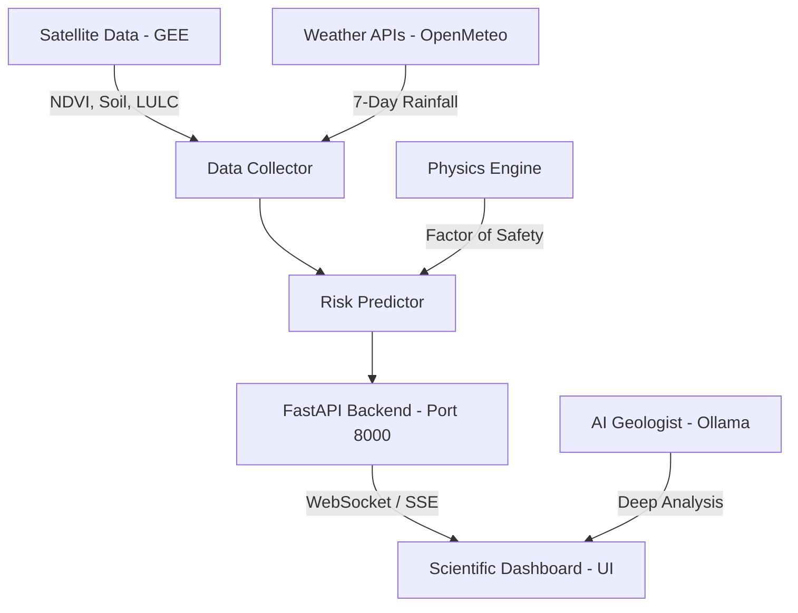

# 🏔️ Kerala Landslide Risk Monitor: A-Z Technical Guide

Welcome to the comprehensive technical documentation for the **Kerala Landslide Risk Monitor (Model 2: Expert Geologist Edition)**. This system combines remote sensing, geotechnical physics, and Large Language Models (LLMs) to provide real-time landslide monitoring and expert analysis.

---

## 🏗️ 1. System Architecture

The project follows a modular, Decoupled Architecture to ensure scalability and real-time performance.



### Key Modules:
*   **`app/main.py`**: The central nervous system focusing on API endpoints, WebSocket management, and SSE streaming.
*   **`app/scheduler.py`**: Handles background updates every 5 minutes to keep rainfall and risk data fresh.
*   **`app/predictor.py`**: Blends Machine Learning (Random Forest) terrain analysis with real-time rainfall data.
*   **`physics_engine.py`**: Calculates the physical stability of slopes using the **Infinite Slope Model**.
*   **`expert_agent.py`**: Interface for the fine-tuned Llama 3.1 model (Dr. Rajan) who explains risks in natural language.

---

## 🔬 2. The Science: Physics Engine

Unlike basic predictors, this system uses real geotechnical equations to determine risk.

### The Infinite Slope Model (Mohr-Coulomb Criterion)
The engine calculates the **Factor of Safety (FoS)**:
$$FoS = \frac{\text{Resisting Forces}}{\text{Driving Forces}}$$

*   **Resisting Forces**: Cohesion of soil + Friction between particles.
*   **Driving Forces**: Gravity acting on the wet soil mass.

### Soil Intelligence
We use a database of 13 soil types, with a special emphasis on **Kerala Laterite**:
*   **Cohesion (c')**: 38.6 kPa
*   **Friction Angle (φ')**: 22.3°
*   **Porosity**: 22%

When rainfall exceeds field capacity, **Pore Water Pressure** rises, reducing effective stress and causing the FoS to drop below **1.0 (Critical Failure)**.

---

## 🧠 3. The Brain: AI Geologist (Llama 3.1)

The "Expert Geologist" isn't just an LLM; it's a domain-specialized agent.

### Training Strategy:
1.  **PDF Extraction**: We extracted text from hundreds of Geological Survey of India (GSI) landslide reports.
2.  **Dataset Generation**: Created thousands of Q&A pairs linking specific soil/slope data to outcome reports.
3.  **LoRA Fine-Tuning**: Applied Low-Rank Adaptation (LoRA) to Llama 3.1 to give it the persona of "Dr. Rajan", a senior geologist with 25 years of experience in the Western Ghats.
4.  **Prompt Strategy**: We use **SSE (Server-Sent Events)** to stream tokens to the UI, making the AI feel responsive and alive.

---

## 🛰️ 4. Data Ingestion & Remote Sensing

### Google Earth Engine (GEE)
The system fetches live satellite data for over 1,500 zones in Kerala:
*   **LULC (Land Use/Land Cover)**: Detects deforestation and urban encroachment.
*   **5-Year NDVI**: Tracks vegetation health trends.
*   **NASA SMAP**: Fetches soil moisture saturation.

### Rainfall Fetcher
*   **Open-Meteo**: Provides high-resolution historical and 7-day predicted rainfall.
*   **Optimization**: We use a **Grid-based Grouping** algorithm to reduce 1,500+ individual API calls down to ~30 grid-point calls, slashing load times by 95%.

---

## 🎨 5. The Scientific Dashboard

Built with a "Dark Mode / Sci-Fi" aesthetic, the dashboard provides elite situational awareness.

*   **Interactive Map**: Leaflet-based map with concentric "ripple" animations for high-risk zones.
*   **Geological Profile**: Displays specific soil and elevation data for the selected zone.
*   **AI Agent Sidebar**: A dedicated chat interface with "What-If" simulation capabilities (e.g., *"What if it rains 200mm tomorrow?"*).
*   **Ticker Log**: Live system feed tracking background computations and alerts.

---

## 🚀 6. Installation & Deployment

### Local Development
1.  **Clone & Install**:
    ```bash
    git clone [repository-url]
    cd landsat_v2
    pip install -r requirements.txt
    ```
2.  **GEE Auth**:
    ```bash
    earthengine authenticate
    ```
3.  **Start AI**:
    ```bash
    ollama run llama3.1
    ```
4.  **Run Backend**:
    ```bash
    python run_server.py
    ```

### Running the Full Build
If you are using the standalone version:
1.  Navigate to `dist/`
2.  Run `KeralaLandslideMonitor.exe`

---

## 🔮 7. Future Roadmap
*   **In-SAR Integration**: Detecting millimeter-level ground movement from space.
*   **Soil Capacity Logic**: Implementation of decay-weighted soil moisture (SWI) to better estimate saturation after long monsoons.
*   **Mobile App**: Companion app for field alerts.

---
*Created by the Landsat-Ai Team | 2026*
